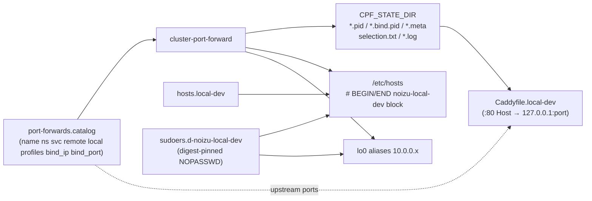
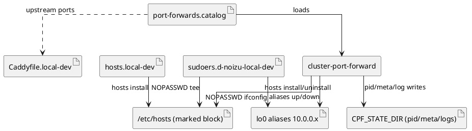

# Data & Config Schema — port-forward-utils

> **No persistence layer.** This project has **no database, no SQL schema, and no
> Liquibase changelogs** — ERDs over tables do not apply. `cluster-port-forward`
> is a stateless-per-run bash CLI: all durable "data" lives in flat config
> assets under `share/` (installed to `~/.local/share/noizu-port-forwards/`) and
> ephemeral state files under `$CPF_STATE_DIR`. This document is the schema
> reference for those artifacts.

Config assets: [port-forwards.catalog](../share/port-forwards.catalog) ·
[hosts.local-dev](../share/hosts.local-dev) ·
[Caddyfile.local-dev](../share/Caddyfile.local-dev) ·
[sudoers.d-noizu-local-dev](../share/sudoers.d-noizu-local-dev)

Artifact relationship map:





---

## 1. Catalog — `share/port-forwards.catalog`

Single source of truth for forward targets. Whitespace-delimited, one service
per line; `#` comments and blank lines ignored. Parsed by `load_catalog()` into
parallel arrays.

| Col | Field | Type | Required | Description |
|-----|-------|------|----------|-------------|
| 1 | `name` | token | Yes | Unique service key (selection id, state filename) |
| 2 | `namespace` | token | Yes | k8s namespace (`-n`) |
| 3 | `service` | token | Yes | k8s Service ref, conventionally `svc/<name>` |
| 4 | `remote_port` | int | Yes | Cluster-side Service port |
| 5 | `local_port` | int | Yes | Loopback high port on `127.0.0.1` (always bound) |
| 6 | `profiles` | CSV | Yes | Comma-separated subset of `data,platform,infra,ai,apps,minio,all` |
| 7 | `bind_ip` | IPv4 | No | Optional lo0 alias (`10.0.0.x`) for secondary PF |
| 8 | `bind_port` | int | No | Port on `bind_ip` (requires col 7; used when `CPF_BIND=1`) |

Example row:

```
app-tsdb  apps  svc/app-timescaledb  5432  54330  data,apps,all  10.0.0.10  5432
```

Current catalog: **18 services** across namespaces `apps`, `platform`,
`infra`, `platform-ai`. Profile semantics: a selection token matches a service
when its `profiles` list contains the token (or token = `all`). Address plan:
`10.0.0.1` edge, `.10–15` data, `.20–22` infra, `.41–44` AI, `.60–64` apps.

Override path: `$CPF_CATALOG`; resolution order otherwise script-relative
`../share/` → XDG data dir → `~/.local/share/noizu-port-forwards/`.

## 2. Environment variables

| Variable | Default | Purpose |
|----------|---------|---------|
| `KUBECONFIG` | `~/.kube/noizu/config` | Exported for all kubectl calls |
| `KUBE_CONTEXT` | *(unset)* | Adds `--context` to kubectl |
| `CPF_STATE_DIR` | `${XDG_RUNTIME_DIR:-/tmp}/noizu-port-forwards` | Runtime state root |
| `CPF_CATALOG` | *(resolved share path)* | Catalog override |
| `CPF_HOSTS_FILE` | *(resolved `hosts.local-dev`)* | Hosts-block source |
| `CPF_BIND` | `1` | Also PF to `bind_ip:bind_port` when set in catalog |
| `CPF_POLL_SEC` | `3` | Supervisor poll interval |
| `CPF_LOG` | `$CPF_STATE_DIR/supervisor.log` | Supervisor log path |

No secret-bearing env vars — credentials stay in Infisical / dc / k8s secrets.

## 3. CLI grammar (`cluster-port-forward`)

```
cluster-port-forward <command> [args…]
  start   [profile|name …]     # default selection: data
  watch   [profile|name …]     # alias: supervise, daemon
  stop    [name|all]
  status                       # alias: st
  list                         # alias: ls
  doctor                       # alias: check
  hosts   print|show|blurb|copy|install|uninstall   # default: print
  aliases up|down|status       # alias: alias; default: status
  help | -h | --help
```

Selection tokens: a profile name (`all|data|platform|infra|ai|apps|minio`) or an
exact catalog `name`; deduplicated in order; empty ⇒ `data` (for `start`/`watch`).

## 4. Runtime state — `$CPF_STATE_DIR` (ephemeral)

Files created/removed by the tool; safe to delete when nothing is running.

| File | Format | Writer | Lifetime |
|------|--------|--------|----------|
| `<name>.pid` | single pid, or literal `external` | `start_pf` | per forward |
| `<name>.bind.pid` | single pid (secondary bind_ip PF) | `start_pf` | per bind forward |
| `<name>.meta` | `key=value` lines: `name ns svc remote local bind_ip bind_port` | `start_one` | per service |
| `selection.txt` | one name per line | `cmd_start` / `cmd_watch` | session |
| `<name>.kubectl.log`, `<name>-bind.kubectl.log` | raw kubectl output | kubectl | session |
| `supervisor.log` | `ISO-timestamp message` lines | `log()` | session |

`external` pid value = local port was already open; tool never kills it.

## 5. `/etc/hosts` managed block

`hosts install` rewrites `/etc/hosts` (via digest-pinned `sudo tee`) keeping an
idempotent block:

```
# BEGIN noizu-local-dev
…contents of share/hosts.local-dev…
# END noizu-local-dev
```

Source lines: `IP  hostname [alias…]` — every name dual-written as `*.dev` and
`*.dev.noizu.local`. `install` replaces the existing block; `uninstall` removes it.

## 6. sudoers template — `share/sudoers.d-noizu-local-dev`

macOS-only. Grants NOPASSWD for exactly three command classes, each sha256
digest-pinned: `ifconfig lo0 ±alias <ip> netmask 255.255.255.0` for the 19
catalog alias IPs (`NOIZU_IFCONFIG_ALIAS` / `_UNALIAS`), and `/usr/bin/tee
/etc/hosts` (`NOIZU_HOSTS_TEE`). Digests must be regenerated after OS updates
(`shasum -a 256 /sbin/ifconfig /usr/bin/tee /bin/cp`); user placeholder
`keithbrings` must be edited before install.

## 7. Caddy edge — `share/Caddyfile.local-dev`

Static config, no state: global block (`auto_https off`, `admin off`), a
`local.dev` health responder, then one site block per HTTP service mapping
`<name>.dev` + `<name>.dev.noizu.local` → `127.0.0.1:<catalog local_port>`.
Must be kept in sync manually with catalog local ports (ports 18081, 16333,
18080, 9000/9001, 14000, 13000, 14040, 13040, 14041).

---

**Integrity rules**: catalog `name` uniqueness (state filenames derive from it);
`bind_port` requires `bind_ip`; hosts block markers exact-match; sudoers digests
pin macOS binary paths — do not hand-edit alias IP lists without regenerating.
