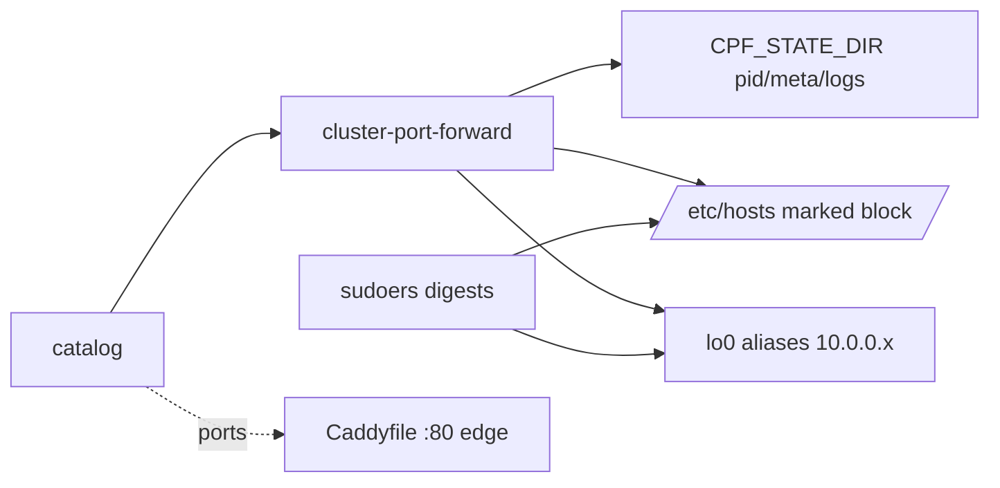

# Data & Config Schema — Summary

**No persistence layer** — no DB/SQL schema; flat config + ephemeral state only.
Full reference: [PROJ-SCHEMA.md](PROJ-SCHEMA.md).

| Artifact | Kind | Format |
|----------|------|--------|
| `share/port-forwards.catalog` | config (source of truth) | 8-col whitespace rows: `name ns svc remote_port local_port profiles[CSV] [bind_ip bind_port]`; 20 services; profiles `data,platform,infra,ai,apps,minio,all` |
| env vars (`KUBECONFIG`, `CPF_*`) | runtime config | 8 vars, no secrets |
| CLI grammar | interface | `start · watch · stop · status · list · doctor · hosts · aliases` + subcommands |
| `$CPF_STATE_DIR/*` | ephemeral state | `<name>.pid` (`external` sentinel), `.bind.pid`, `.meta` key=value, `selection.txt`, kubectl/supervisor logs |
| `/etc/hosts` block | managed output | `# BEGIN/END noizu-local-dev` markers, idempotent rewrite |
| `share/sudoers.d-noizu-local-dev` | host config (macOS) | sha256 digest-pinned NOPASSWD `ifconfig`/`tee` |
| `share/Caddyfile.local-dev` | edge config | static Host-route :80 → 127.0.0.1 high ports |

